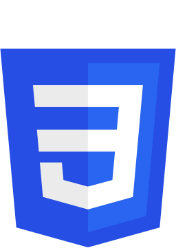
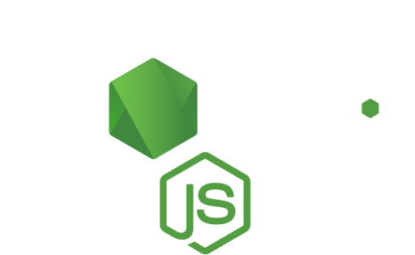

<h1 align="center">
    Hello
    , I'm Shreyas Jadhav 
</h1>
<h3 align="center">A Full Stack Developer from India</h3>

    <abbr style="text-decoration:none"  title="LinkedIn"></abbr>
    <abbr style="text-decoration:none"  title="Twitter"></abbr>
    <abbr style="text-decoration:none"  title="Dev.to"></abbr>

    

<h2 align="left" style="font-weight:600; "> 👨🏼‍💻 About Me:</h2>

- 💬 I'm Proficient in **React, Django, Flask, Node** 

- 📫 You can reach me at **jshreyas12@gmail.com** 

- 📄 Know more about me **[Resume](https://drive.google.com/file/d/1nAZO6RqhvKlC9ovSBYUUG133C49dtlkH/view)**

- 🌱 I’m currently learning **Blockchain and Docker** 

---
 
<h2 align="left" style="font-weight:600; ">🌟 Coding Platforms:</h2>

     <abbr style="text-decoration:none"  title="Codeshef"></abbr> &ensp;
     <abbr style="text-decoration:none"  title="Codeforces"></abbr>
     <abbr style="text-decoration:none"  title="Leetcode"></abbr>

 

<h2 align="left" style="font-weight:600; ">📖 Languages:</h2>

     <abbr style="text-decoration:none"  title="C Language"></abbr>
     <abbr style="text-decoration:none"  title="C++"></abbr>
     <abbr style="text-decoration:none"  title="Python"></abbr>
     <abbr style="text-decoration:none"  title="Javascript"></abbr>
     <abbr style="text-decoration:none"  title="HTML"></abbr>
     <abbr style="text-decoration:none"  title="CSS"></abbr>

 
<h2 align="left" style="font-weight:600; ">🛠️ Frameworks and Tools:</h2>

     <abbr style="text-decoration:none"  title="Reactjs"></abbr>
     <abbr style="text-decoration:none"  title="Django"></abbr>
     <abbr style="text-decoration:none"  title="Flask"></abbr>
     <abbr style="text-decoration:none"  title="Node.js"></abbr>
     <abbr style="text-decoration:none"  title="Bootstrap"></abbr>
     <abbr style="text-decoration:none"  title="Git"></abbr>
     <abbr style="text-decoration:none"  title="MariaDB"></abbr>
     <abbr style="text-decoration:none"  title="MongoDB"></abbr>
     <abbr style="text-decoration:none"  title="MySQL"></abbr>

 

---

 
<h2 align="left" style="font-weight:600; "> 📊 My Stats:</h2>
 

    
    &ensp; &ensp;
    

